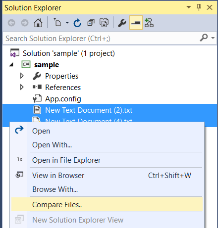
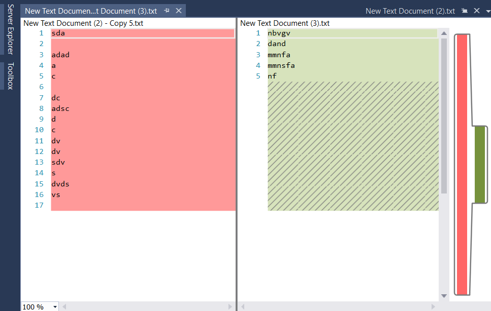

# FilesDiffer

<!-- Update the VS Gallery link after you upload the VSIX-->
Download this extension from the [VS Gallery](https://visualstudiogallery.msdn.microsoft.com/[GuidFromGallery])
or get the [CI build](http://vsixgallery.com/extension/33f7d7d-a4ab-4d76-a739-62e32893d24c/).

---------------------------------------

Simpliest way to compare two files from the project from the solution explorer

See the [change log](CHANGELOG.md) for changes and road map.

## Features

- compare two files from Solution Explorer in a single click...

### compare Files
Select two files in solution explorer and right click..

Then select "compare files..." to see the diff view 

## Contribute
Check out the [contribution guidelines](CONTRIBUTING.md)
if you want to contribute to this project.

For cloning and building this project yourself, make sure
to install the
[Extensibility Tools 2015](https://visualstudiogallery.msdn.microsoft.com/ab39a092-1343-46e2-b0f1-6a3f91155aa6)
extension for Visual Studio which enables some features
used by this project.

## License
[Apache 2.0](LICENSE)